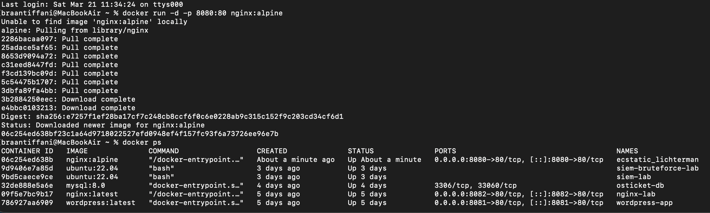

# Docker NGINX Lab – Port Mapping

## Overview

This lab demonstrates how to deploy an NGINX web server using Docker and expose it to a host machine using port mapping.

## What I Did

- Pulled the NGINX Docker image (nginx:alpine)
- Ran a container using Docker
- Mapped port 8080 on the host to port 80 in the container
- Verified the container was running using `docker ps`
- Accessed the web server via http://localhost:8080/

## Command Used

```bash
docker run -d -p 8080:80 nginx:alpine

## Screenshots

### Container Running


### NGINX Web Server

# nginx-docker-lab
